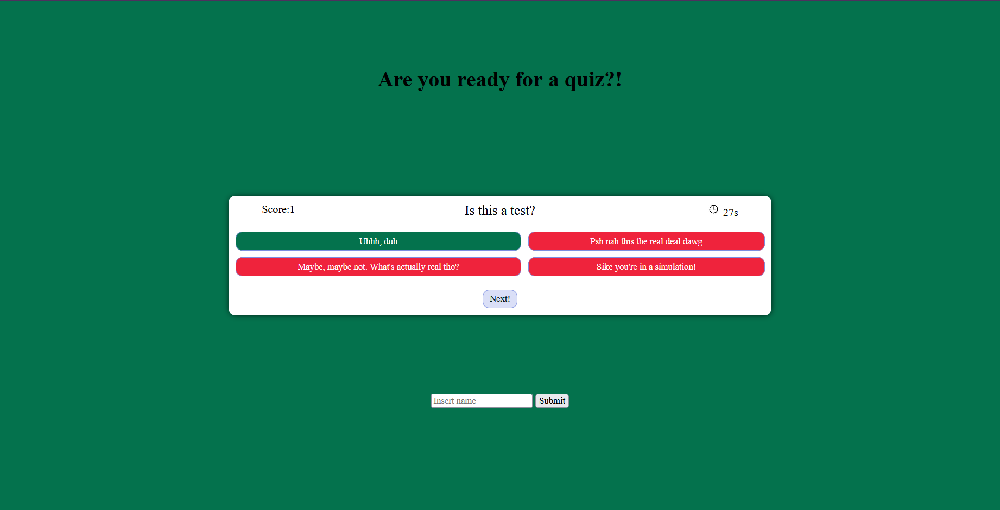

# My First Quiz

## User Story
AS A coding boot camp student
I WANT to take a timed quiz on JavaScript fundamentals that stores high scores
SO THAT I can gauge my progress compared to my peers

## Acceptance Criteria
GIVEN I am taking a code quiz

WHEN I click the start button
THEN a timer starts and I am presented with a question

WHEN I answer a question
THEN I am presented with another question

WHEN I answer a question incorrectly
THEN time is subtracted from the clock

WHEN all questions are answered or the timer reaches 0
THEN the game is over

WHEN the game is over
THEN I can save my initials and score

## Description

Built a quiz from scratch in order to use new javascript knowledge. The user is provided with a basic quiz with a timer
and score and is told whether or not their answer is correct. The user is also able to log in their score and check in the
console to see it. The questions and answers are nonsensical but serve their function.

## Link and Screenshot

https://achurale.github.io/My-First-Quiz/

## Credits

Thank you to my fellow classmates as per usual, to tutor Alexis San Javier, and to the YouTube channel Web Dev Simplified for getting me started.
